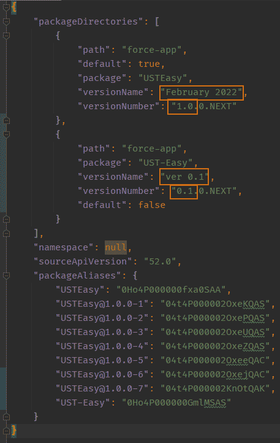

# Packaging UST-EASY

This documentation describes the process that the University of St. Thomas uses to make an org dependent, unlocked
package of the UST-EASY app (University of St. Thomas' version of Enterprise Application Solution for Yield -
EASY).

[Triailhead about unlocked packages](https://trailhead.salesforce.com/en/content/learn/modules/unlocked-packages-for-customers/build-your-first-unlocked-package)

[Org dependant Unlocked packagin](https://developer.salesforce.com/docs/atlas.en-us.sfdx_dev.meta/sfdx_dev/sfdx_dev_unlocked_pkg_org_dependent.htm)

## Process

### Step 1: (only needs to be done once to set up the org dependant unlocked package)

The following command will create the initial package and the sfdx-project file. You only have to do this once so
skip this test if you see an sfdx-project file and your package name is in it.

```
sfdx force:package:create -t Unlocked -r force-app -n UST-Easy --orgdependent
```

-t : (type) Unlocked

-r : directory of project

-n : Name of the project (no spaces)

--orgdependant : makes it so all validation of the code is done on installation instead of pre-testing the package

### Step 2: increment the version

Since step on sets up the package from now on you only need to version the package -- SO SKIP STEP ONE! Great!

When creating a new version of a package you will need to edit the sfdx-project.json file to version your new package.

If your package is still in beta you don't need to edit the sfdx-project file as beta version auto increment (skip to step 3).

The following sfdx-project.json file image is tracking two packages. One is a standard package (USTEasy) from a previous
experiment and the other is an org dependent package (UST-Easy). We are going to focus on the UST-Easy package.

The version number is incremented on the first two decimal
seperated numbers. The last decimal and the .NEXT are reserved for patches and auto beta versioning. The version name portion
can be any string name you want. Usually Month and year is sufficient for a version name.


The package alias section is a receipt of package ids used in an installation link. These Ids
can be retrieved later via a sfdx command so if they get deleted it isn't the end of the world.



### Step 3: creating a version of the package

Run the following command to creat a new version of your package.

```
sfdx force:package:version:create -p UST-Easy -d force-app --installationkeybypass --wait 10 -v EDA-PROD-DEV-HUB
``` 
-p : the name of the package

-d : the directory of the package code

--installationkeybypass : no secret code needed to install this package

--wait 10 : the amount of time to wait for the package to be built before recieving the notification to come back later

-v : the alias of your dev hub (it may not be EDA-PROD-DEV-HUB in your case). Your dev hub needs to be St. Thomas'
EDA prod org.

### Step 4: Promote your package to release

In order for a beta package to come out of beta to be a fully released version you need to promote the beta version with the following command:

```
sfdx force:package:version:promote -p version_01_id -n
```

**version_01_id**: replace this with the beta version you wish to promote.
You can consult the sfdx-project.json to see what version that might be as it updates
during beta package creation.

Promoted packages will use the same URL as the beta package. It may take several
minutes before the package will appear to not be in beta. If you followed the
installation URL and it still says that the package is beta wait on it until the beta
flag is removed. Simply refresh the package installation page until it no longer
says beta.

### Installing a package (beta or promoted release)

At the end of packaging you will get a URL to install the package. It will look like
this with "login.salesforce.com" replaced with your custom salesforce domain and
***version_01_id*** replaced with the package id. Don't install beta packages
in production orgs.

```
https://login.salesforce.com/packagingSetupUI/ipLanding.app?apvId=version_01_id
```
